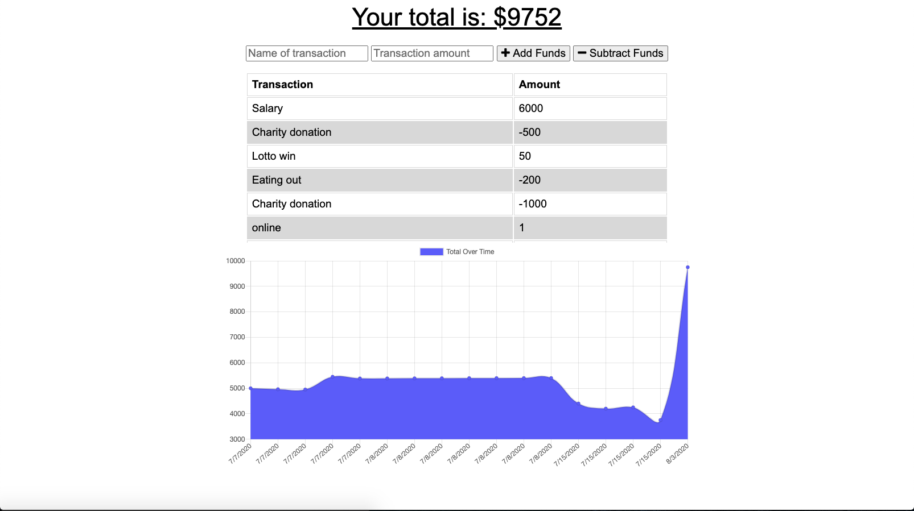

## Project Name

# Online/Offline Budget Tracker

> This progressive web application allows the user add expenses and deposits to their budget with or without a connection.

#### [View The Site](https://agile-sands-10651.herokuapp.com/) - The project is live.

---

### Table of Contents

- [Description](#description)
- [Technologies](#technologies)
- [Installation](#installation)
- [How To Use](#how-to-use)
- [Test(s)](#tests)
- [Contributors](#contributors)
- [Questions](#questions)
- [License](#license)

---

## Description

This progressive web application allows the user to log budget deposits and expenses either with or without an internet connection.

While connected, the user data is stored within a MongoDB database and includes the name of the transaction, the amount and the date and time.  

If the user loses connection or is out of internet service, the app will store the data within an IndexedDB database.  When the connection is restored the data will be populated to the MongoDB database.

[Back To The Top](#project-name)

---

## Technologies

 

- Javascript, node.js, mongoDB, IndexedDB, Express.js, HTML, CSS

[Back To The Top](#project-name)

---

## Installation

Simply click the following link to load the application in your browser.

#### [View The Site](https://agile-sands-10651.herokuapp.com/) - The project is live.

[Back To The Top](#project-name)

---

## How To Use

Once the application is loaded in the browser, simply enter the name of the transaction in the first input field, enter the transaction amount in the second input field and select the appropriate button to either add or subtract the amount of the funds from your balance.

[Back To The Top](#project-name)

---

## Tests

There are no tests.

[Back To The Top](#project-name)

---

## Contributors

- Nate Valline

[Back To The Top](#project-name)

---

## Questions

Please contact the following for any questions.

  =>  contact@natevalline.com

[Back To The Top](#project-name)

---

## License

MIT License

Copyright (c) 2020 Nate Valline

Permission is hereby granted, free of charge, to any person obtaining a copy
of this software and associated documentation files (the "Software"), to deal
in the Software without restriction, including without limitation the rights
to use, copy, modify, merge, publish, distribute, sublicense, and/or sell
copies of the Software, and to permit persons to whom the Software is
furnished to do so, subject to the following conditions:

The above copyright notice and this permission notice shall be included in all
copies or substantial portions of the Software.

THE SOFTWARE IS PROVIDED "AS IS", WITHOUT WARRANTY OF ANY KIND, EXPRESS OR
IMPLIED, INCLUDING BUT NOT LIMITED TO THE WARRANTIES OF MERCHANTABILITY,
FITNESS FOR A PARTICULAR PURPOSE AND NONINFRINGEMENT. IN NO EVENT SHALL THE
AUTHORS OR COPYRIGHT HOLDERS BE LIABLE FOR ANY CLAIM, DAMAGES OR OTHER
LIABILITY, WHETHER IN AN ACTION OF CONTRACT, TORT OR OTHERWISE, ARISING FROM,
OUT OF OR IN CONNECTION WITH THE SOFTWARE OR THE USE OR OTHER DEALINGS IN THE
SOFTWARE.

[Back To The Top](#project-name)

---
    